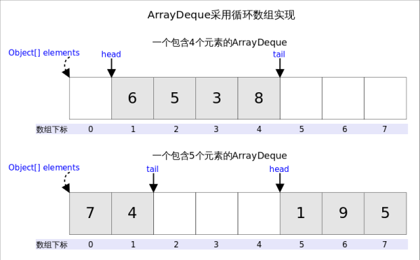
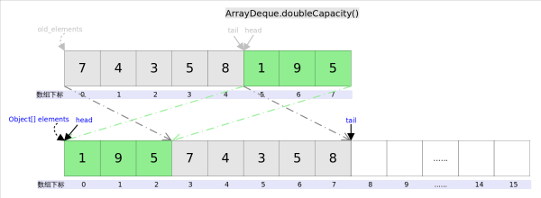
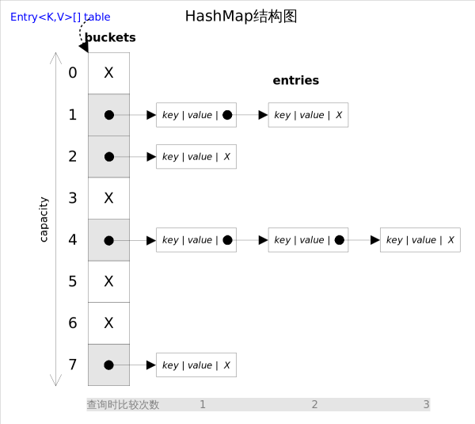
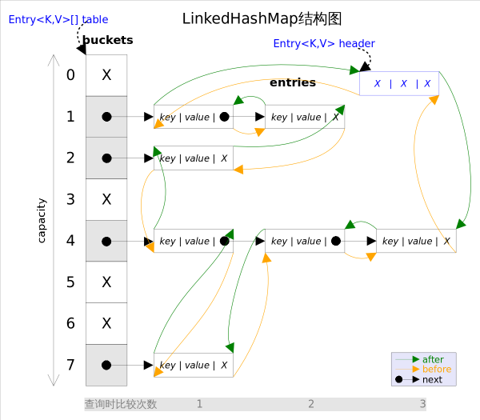

#数据结构
- 栈（stack）又名堆栈，它是一种运算受限的线性表。其限制是仅允许在表的一端进行插入和删除运算。这一端被称为栈顶，相对地，把另一端称为栈底。
- 队列（queue)是一种特殊的线性表，特殊之处在于它只允许在表的前端（front）进行删除操作，而在表的后端（rear）进行插入操作，和栈一样，队列是一种操作受限制的线性表。进行插入操作的端称为队尾，进行删除操作的端称为队头。
- 双端队列（deque）

##ArrayList

###介绍
ArrayList实现了List接口，是顺序容器，即元素存放的数据与放进去的顺序相同，允许放入null元素，底层通过数组实现。除该类未实现同步外，其余跟Vector大致相同。每个ArrayList都有一个容量（capacity），表示底层数组的实际大小，容器内存储元素的个数不能多于当前容量。当向容器中添加元素时，如果容量不足，容器会自动增大底层数组的大小。前面已经提过，Java泛型只是编译器提供的语法糖，所以这里的数组是一个Object数组，以便能够容纳任何类型的对象。

初始化长度为0的空数组，添加第一个元素时，长度设置为length=10

###方法剖析

##### set(int index, E element)
既然底层是一个数组，ArrayList的set()方法也就变得非常简单，直接对数组的指定位置赋值即可。**注意下标越界检查**

#####get()
同样很简单，唯一要注意的是由于底层数组是Object[]，得到元素后需要进行类型转换。**注意下标越界检查和类型转换**

#####add(E e)，addAll(Collection<? extends E> c)
添加元素之前要进行剩余空间检查。如果添加之后的元素数量会大于数组的容量，则进行**自动扩容**。

新容量newCapacity先扩充为原来容量oldCapacity的1.5倍，若还是小于元素数量minCapacity，则就将新容量扩充到和元素数量一样多。如果此时数组新容量超过了Java数组的最大长度=Integer.MAXVALUE-8

> （Java数组长度，有两层限制，一是length必须是非负的int，理论最大值就是Integer.MAXVALUE = 2*31-1 = 2147483647。二是具体的JVM实现带来的限制。为什么不用long记录长度，因为会大大超出内存的容量。int的最大值会占用2G内存。减去8是因为JVM会保留一些头信息在数组中）

再判断元素数量minCapacity是否超出数组的最大长度，如果超出就设置为Integer.MAXVALUE，会抛弃超出部分，没有就设置为数组的最大长度。然后将旧数组复制到新的数组中去，并将新的值添加到末尾。

**复制数组的方法：**`System.arraycopy(Object[] src, int srcPos, Object[] dest, int destPos, int length)`

src:源数组，srcPos:要复制的内容在源数组的起始位置，dest:目标数组，destPos:复制过来的内容要粘贴到目标数组的起始位置，length:复制内容的长度。注意各个位置不要越界。

#####add(int index, E e)，addAll(int index, Collection<? extends E> c)
先移动部分元素，再完成插入操作

#####remove(int index)，remove(Object o)
remove(Object o)删除第一个满足o.equals(elementData[index])的元素

将删除点之后的元素向前移动一个位置，并将最后一个元素赋为null，是为了让GC起作用，删除之后没有把数组容量缩小。

##LinkedList

###介绍
LinkedList同时实现了List接口和Deque接口，也就是说它既可以看作一个顺序容器，又可以看作一个队列（Queue），同时又可以看作一个栈（Stack）。这样看来，LinkedList简直就是个全能冠军。当你需要使用栈或者队列时，可以考虑使用LinkedList，一方面是因为Java官方已经声明不建议使用Stack类，更遗憾的是，Java里根本没有一个叫做Queue的类（它是个接口名字）。关于栈或队列，现在的首选是ArrayDeque，它有着比LinkedList（当作栈或队列使用时）有着更好的性能。

**LinkedList底层通过双向链表实现，**双向链表的每个节点用内部类Node表示。LinkedList通过**first**和**last**引用分别指向链表的第一个和最后一个元素。注意这里没有所谓的哑元，当链表为空的时候first和last都指向null。**向其中添加null，是添加了一个item=null的Node，该Node不为null**，内容都保存在Node.item中，list中保存的是node

	private static class Node<E> {
    	E item; 
    	Node<E> next;
    	Node<E> prev;
    	Node(Node<E> prev, E element, Node<E> next) {
        	this.item = element;
        	this.next = next;
        	this.prev = prev;
    	}
	}

增删改其中的元素，要注意：检查是否越界，要操作的元素是否第一个或最后一个，理顺受影响的元素的前后引用。没有容量限制，但其size属性是int类型的，应该最大值为Integer.MAX_VALUE

##ArrayDeque
###介绍
Java里有一个叫做Stack的类，却没有叫做Queue的类（它是个接口名字）。当需要使用栈时，Java已不推荐使用Stack，而是推荐使用更高效的ArrayDeque(非线程安全，不允许null值，容量最小为8，默认16，必须是2的幂，内部是循环数组，数组的任何一点都可以当做起点）；ArrayDeque和LinkedList是Deque的两个通用实现，官方更推荐使用AarryDeque用作栈和队列

要讲栈和队列，首先要讲Deque接口。Deque的含义是“double ended queue”，即双端队列，它既可以当作栈使用，也可以当作队列使用。

Queue和Deque的异同

Stack和Deque的异同

Deque有很多方法，主要是向首部尾部添加，获取首尾部元素，删除首尾部元素，再区分是否报错，分成两套方法，共12个。

ArrayDeque的循环数组

head指向首端第一个有效元素，**tail指向尾端第一个可以插入元素的空位**。因为是循环数组，所以head不一定总等于0，tail也不一定总是比head大。

空间问题是在插入之后解决的，因为tail总是指向下一个可插入的空位，也就意味着elements数组至少有一个空位，所以插入元素的时候不用考虑空间问题。

插入之后判断head==tail，如果相等就要扩容了，其逻辑是申请一个更大的数组（原数组的两倍），然后将原数组复制过去。过程如下图所示：

图中我们看到，复制分两次进行，第一次复制head右边的元素，第二次复制head左边的元素。也是用的System.arraycopy方法。

经常用到的下标越界处理：`if ( (tail = (tail + 1) & (elements.length - 1)) == head)`

&是位运算中的与，两个操作数中位都为1，结果才为1，否则结果为0，例如下面的程序段。length始终是2的级数，所以二进制是类似1000，length-1就成了0111，如果tail+1达到了最大值，即1000，那么1000&0111=0000，成了首位，这时判断是否与head相等，相等的话就要扩容double。

相当于(tail+1)%length的取余运算

##TreeMap、TreeSet
TreeMap实现了SortedMap接口，也就是说会按照key的大小顺序对Map中的元素进行排序，key大小的评判可以通过其本身的自然顺序（natural ordering），也可以通过构造时传入的比较器（Comparator）。

TreeMap底层通过红黑树（Red-Black tree）实现，也就意味着containsKey(), get(), put(), remove()都有着log(n)的时间复杂度。其具体算法实现参照了《算法导论》。

##HashMap、HashSet
HashMap实现了Map接口，允许放入null元素，除该类未实现同步外，其余跟Hashtable大致相同，跟TreeMap不同，该容器不保证元素顺序，根据需要该容器可能会对元素重新哈希，元素的顺序也会被重新打散，因此不同时间迭代同一个HashMap的顺序可能会不同。容量必须是2的幂，最大容量2的30次方，负载因子默认0.75

对于HashMap有两个重要的参数：初始容量initialCapacity、负载因子loadFactor。容量表示哈希表中桶的数量，初始容量是创建的哈希表的大小。负载因子是哈希表在其容量自动增加之前可以达到多满的一种尺度，它衡量的是一个散列表的空间的使用程度

根据对冲突的处理方式不同，哈希表有两种实现方式，一种开放地址方式（Open addressing），另一种是冲突链表方式（Separate chaining with linked lists）。Java HashMap采用的是冲突链表方式。

从上图容易看出，如果选择合适的哈希函数，put()和get()方法可以在常数时间内完成。但在对HashMap进行迭代时，需要遍历整个table以及后面跟的冲突链表。因此对于迭代比较频繁的场景，不宜将HashMap的初始大小设的过大。

#####get()
get(Object key)方法根据指定的key值返回对应的value，该方法调用了getEntry(Object key)得到相应的entry，然后返回entry.getValue()。因此getEntry()是算法的核心。
算法思想是首先通过hash()函数得到对应桶的下标，然后依次遍历冲突链表，通过key.equals(k)方法来判断是否是要找的那个entry。

##LinkedHashMap、LinkedHashSet
LinkedHashMap实现了Map接口，即允许放入key为null的元素，也允许插入value为null的元素。从名字上可以看出该容器是linked list和HashMap的混合体，也就是说它同时满足HashMap和linked list的某些特性。可将LinkedHashMap看作采用linked list增强的HashMap。

事实上LinkedHashMap是HashMap的直接子类，二者唯一的区别是LinkedHashMap在HashMap的基础上，采用双向链表（doubly-linked list）的形式将所有entry连接起来，这样是为保证元素的迭代顺序跟插入顺序相同。上图给出了LinkedHashMap的结构图，主体部分跟HashMap完全一样，多了header指向双向链表的头部（是一个哑元），该双向链表的迭代顺序就是entry的插入顺序。

除了可以保迭代历顺序，这种结构还有一个好处：迭代LinkedHashMap时不需要像HashMap那样遍历整个table，而只需要直接遍历header指向的双向链表即可，也就是说LinkedHashMap的迭代时间就只跟entry的个数相关，而跟table的大小无关。

出于性能原因，LinkedHashMap是非同步的（not synchronized），如果需要在多线程环境使用，需要程序员手动同步；或者通过如下方式将LinkedHashMap包装成（wrapped）同步的：

`Map m = Collections.synchronizedMap(new LinkedHashMap(...));`

#####put()
put(K key, V value)方法是将指定的key, value对添加到map里。该方法首先会对map做一次查找，看是否包含该元组，如果已经包含则直接返回，查找过程类似于get()方法；如果没有找到，则会通过addEntry(int hash, K key, V value, int bucketIndex)方法插入新的entry。

注意，这里的插入有两重含义：

1. 从table的角度看，新的entry需要插入到对应的bucket里，当有哈希冲突时，采用头插法将新的entry插入到冲突链表的头部。
2. 从header的角度看，新的entry需要插入到双向链表的尾部。