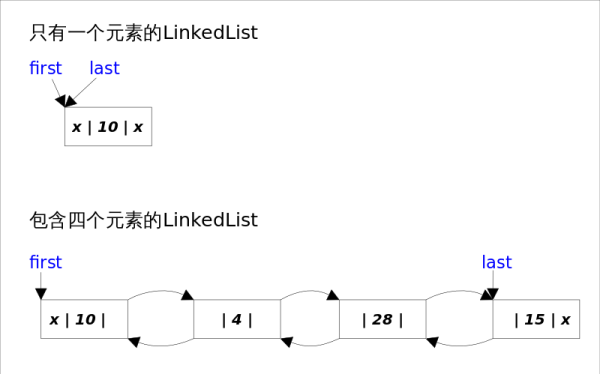
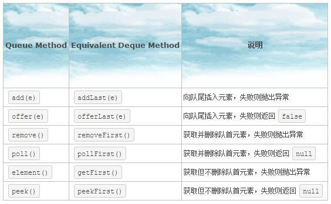
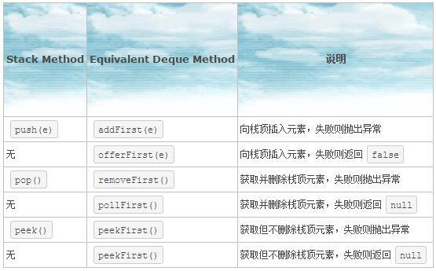

#数据结构
- 栈（stack）又名堆栈，它是一种运算受限的线性表。其限制是仅允许在表的一端进行插入和删除运算。这一端被称为栈顶，相对地，把另一端称为栈底。
- 队列是一种特殊的线性表，特殊之处在于它只允许在表的前端（front）进行删除操作，而在表的后端（rear）进行插入操作，和栈一样，队列是一种操作受限制的线性表。进行插入操作的端称为队尾，进行删除操作的端称为队头。

##ArrayList

###介绍
ArrayList实现了List接口，是顺序容器，即元素存放的数据与放进去的顺序相同，允许放入null元素，底层通过数组实现。除该类未实现同步外，其余跟Vector大致相同。每个ArrayList都有一个容量（capacity），表示底层数组的实际大小，容器内存储元素的个数不能多于当前容量。当向容器中添加元素时，如果容量不足，容器会自动增大底层数组的大小。前面已经提过，Java泛型只是编译器提供的语法糖，所以这里的数组是一个Object数组，以便能够容纳任何类型的对象。

初始化长度为0的空数组，添加第一个元素时，长度设置为length=10

###方法剖析

##### set(int index, E element)
既然底层是一个数组，ArrayList的set()方法也就变得非常简单，直接对数组的指定位置赋值即可。**注意下标越界检查**

#####get()
同样很简单，唯一要注意的是由于底层数组是Object[]，得到元素后需要进行类型转换。**注意下标越界检查和类型转换**

#####add(E e)，addAll(Collection<? extends E> c)
添加元素之前要进行剩余空间检查。如果添加之后的元素数量会大于数组的容量，则进行**自动扩容**。

先扩充为原来容量的1.5倍，若还是小于元素数量，则就将容量扩充到和元素数量一样多。如果此时数组容量超过了Java数组的最大长度=Integer.MAXVALUE-8

> （Java数组长度，有两层限制，一是length必须是非负的int，理论最大值就是Integer.MAXVALUE = 2*31-1 = 2147483647。二是具体的JVM实现带来的限制。为什么不用long记录长度，因为会大大超出内存的容量。int的最大值会占用2G内存。减去8是因为JVM会保留一些头信息在数组中）

再判断真正所需的容量是否超出数组的最大长度，如果超出就设置为Integer.MAXVALUE，没有就设置为数组的最大长度。然后将旧数组复制到新的数组中去，并将新的值添加到末尾。

**复制数组的方法：**`System.arraycopy(Object[] src, int srcPos, Object[] dest, int destPos, int length)`

src:源数组，srcPos:要复制的内容在源数组的起始位置，dest:目标数组，destPos:复制过来的内容要粘贴到目标数组的起始位置，length:复制内容的长度。注意各个位置不要越界。

#####add(int index, E e)，addAll(int index, Collection<? extends E> c)
先移动部分元素，再完成插入操作。不能插到最后位置，应该用add(E e)

#####remove(int index)，remove(Object o)
remove(Object o)删除第一个满足o.equals(elementData[index])的元素

将删除点之后的元素向前移动一个位置，并将最后一个元素赋为null，是为了让GC起作用

##LinkedList

###介绍
LinkedList同时实现了List接口和Deque接口，也就是说它既可以看作一个顺序容器，又可以看作一个队列（Queue），同时又可以看作一个栈（Stack）。这样看来，LinkedList简直就是个全能冠军。当你需要使用栈或者队列时，可以考虑使用LinkedList，一方面是因为Java官方已经声明不建议使用Stack类，更遗憾的是，Java里根本没有一个叫做Queue的类（它是个接口名字）。关于栈或队列，现在的首选是ArrayDeque，它有着比LinkedList（当作栈或队列使用时）有着更好的性能。

**LinkedList底层通过双向链表实现，**双向链表的每个节点用内部类Node表示。LinkedList通过**first**和**last**引用分别指向链表的第一个和最后一个元素。注意这里没有所谓的哑元，当链表为空的时候first和last都指向null。**向其中添加null，是添加了一个item=null的Node，该Node不为null**，内容都保存在Node.item中，list中保存的是node

	private static class Node<E> {
    	E item; 
    	Node<E> next;
    	Node<E> prev;
    	Node(Node<E> prev, E element, Node<E> next) {
        	this.item = element;
        	this.next = next;
        	this.prev = prev;
    	}
	}

增删改其中的元素，要注意：检查是否越界，要操作的元素是否第一个或最后一个，理顺受影响的元素的前后引用

##ArrayDeque
###介绍
Java里有一个叫做Stack的类，却没有叫做Queue的类（它是个接口名字）。当需要使用栈时，Java已不推荐使用Stack，而是推荐使用更高效的ArrayDeque；既然Queue只是一个接口，当需要使用队列时也就首选ArrayDeque了（次选是LinkedList）。

要讲栈和队列，首先要讲Deque接口。Deque的含义是“double ended queue”，即双端队列，它既可以当作栈使用，也可以当作队列使用。

Queue和Deque的异同

Stack和Deque的异同

