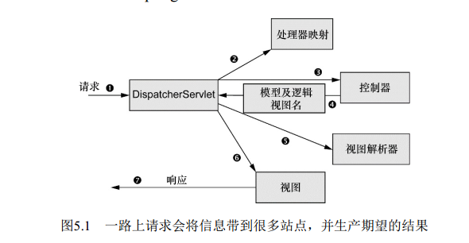

#Spring in action

##Spring MVC

###跟踪请求
1. 用户在Web浏览器中点击链接或提交表单，包含请求的URL或表单信息
2. 第一站是Spring的前端控制器DispatcherServlet，这个单实例的Servlet的任务是将请求发送给Spring MVC控制器（controller），根据请求所携带的URL信息查询处理器映射（handler mapping）来确定请求的下一站在哪里
3. 到了控制器，请求会卸下其负载（用户提交的信息），将业务逻辑委托给服务对象(service)进行处理。处理完成后会产生一些信息(model)返回给用户，原始信息是不行的，通常是一个视图(view)。控制器将模型数据打包，并且标示出用于渲染输出的视图名。它接下来会将请求连同模型和视图名发送回DispatcherServlet
4. DispatcherServlet将会使用视图解析器（view resolver）来将逻辑视图名匹配为一个特定的视图实现。
5. 最后一站是视图的实现，在这里它交付模型数据。请求的任务就完成了。视图将使用模型数据渲染输出，这个输出会通过响应对象传递给客户端（不会像听上去那样硬编码)

###配置DispatcherServlet
DispatcherServlet是Spring MVC的核心。在这里请求会第一次
接触到框架，它要负责将请求路由到其他的组件之中。

借助于Servlet 3规范和Spring 3.1的功能增强，我们会使用Java将DispatcherServlet配置在Servlet容器中，而不会再使用web.xml文件。

扩展`AbstractAnnotationConfigDispatcherServletInitializer`的任意类都会自动地
配置Dispatcher-Servlet和Spring应用上下文， Spring的应用上下
文会位于应用程序的Servlet上下文之中。

> 在Servlet 3.0环境中，容器会在类路径中查找实现`javax.servlet.ServletContainerInitializer`接口的类，如果能发现的话，就会用它来配置Servlet容器。Spring提供了这个接口的实现，名为`SpringServletContainerInitializer`，这个类反过来又会查找实现`WebApplicationInitializer`的类并将配置的任务交给它们来完成。 Spring 3.2引入了一个便利的`WebApplicationInitializer`基础实现，也就是`AbstractAnnotationConfigDispatcherServletInitializer`因为我们的`Spittr-WebAppInitializer`扩展了`AbstractAnnotationConfig DispatcherServletInitializer`（同时也就实现了`WebApplicationInitializer`），因此当部署到Servlet 3.0容器中的时候，容器会自动发现它，并用它来配置Servlet上下文。

###启用Spring MVC
以前，Spring是使用XML进行配置的，可以使用<mvc:annotation-driven>启用注解驱动的Spring MVC。

现在最少的配置需要：@EnableWebMvc、@ComponentScan、配置视图解析器、配置静态资源处理。